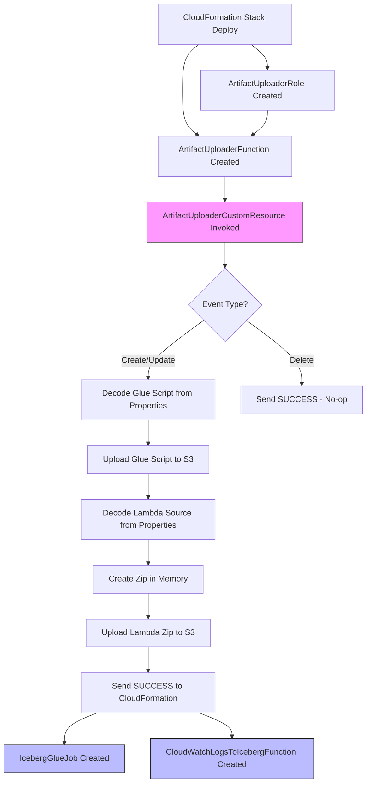

# Design Document: CFN Script Deployment

## Overview

This feature replaces the manual `scripts/deploy.sh` step with a CloudFormation Custom Resource that automatically uploads the Glue ETL script and Lambda function zip to S3 during stack deployment. The Custom Resource Lambda is defined inline in the template and executes as the first resource action, ensuring all dependent resources (Glue job, Lambda function) can reference their S3 artifacts.

### Key Design Decision: Encoded Content via Resource Properties

The CloudFormation `ZipFile` property has a strict 4096-character limit. The two source files total ~10.5KB raw, and even with maximum compression (zlib level 9 + base64), the encoded data alone exceeds 4KB. The solution passes the encoded script content as **Custom Resource Properties** rather than embedding it in the ZipFile code. This keeps the handler code at ~1100 characters while the encoded payloads live in the template body (which supports up to 51KB direct or 460KB via S3).

### Design Rationale: Single Lambda vs Two Lambdas

A single Custom Resource Lambda handles both artifacts because:
- Both uploads are logically one atomic operation (either both succeed or the stack fails)
- Reduces template complexity (one role, one function, one custom resource)
- The handler code fits comfortably within 4096 characters when data is passed via properties
- Simpler DependsOn graph (one resource for downstream dependencies)

## Architecture



## Components and Interfaces

### 1. ArtifactUploaderRole (AWS::IAM::Role)

IAM role for the Custom Resource Lambda with least-privilege permissions.

- **Trust Policy**: `lambda.amazonaws.com` service principal
- **Managed Policies**: `AWSLambdaBasicExecutionRole`
- **Inline Policy**: `s3:PutObject` scoped to:
  - `arn:aws:s3:::{GlueScriptBucketName}/scripts/*`
  - `arn:aws:s3:::{LambdaScriptBucketName}/lambda/*`

### 2. ArtifactUploaderFunction (AWS::Lambda::Function)

Inline Lambda function that handles CloudFormation Custom Resource lifecycle events.

| Property | Value |
|----------|-------|
| Runtime | python3.12 |
| Handler | index.handler |
| Timeout | 120 seconds |
| Role | !GetAtt ArtifactUploaderRole.Arn |
| Code.ZipFile | Inline handler (~1100 chars) |

**Handler Logic:**
1. On `Delete` event: immediately send SUCCESS (no-op)
2. On `Create`/`Update` event:
   - Read `GlueScriptEncoded` from ResourceProperties
   - Decode (base64 → zlib decompress) to get raw Glue script
   - Upload to `s3://{GlueBucket}/scripts/sample-glue-job-iceberg-materializedview-builder.py`
   - Read `LambdaScriptEncoded` from ResourceProperties
   - Decode to get raw Lambda source
   - Create in-memory zip with `lambda_function.py` entry
   - Upload to `s3://{LambdaBucket}/lambda/lambda_function.zip`
   - Send SUCCESS response
3. On any exception: send FAILED response with error message

### 3. ArtifactUploaderCustomResource (AWS::CloudFormation::CustomResource)

The Custom Resource that triggers the Lambda during stack lifecycle.

**Properties passed to Lambda:**
- `ServiceToken`: ARN of ArtifactUploaderFunction
- `GlueBucket`: !Ref GlueScriptBucketName
- `LambdaBucket`: !Ref LambdaScriptBucketName
- `GlueScriptEncoded`: Base64+zlib encoded content of the Glue script
- `LambdaScriptEncoded`: Base64+zlib encoded content of the Lambda function

### 4. Dependency Ordering

Resources that depend on uploaded artifacts declare `DependsOn: ArtifactUploaderCustomResource`:
- `IcebergGlueJob` — needs the Glue script in S3
- `CloudWatchLogsToIcebergFunction` — needs the Lambda zip in S3

## Data Models

### CloudFormation Custom Resource Event (Input)

```json
{
  "RequestType": "Create | Update | Delete",
  "ResponseURL": "https://pre-signed-url...",
  "StackId": "arn:aws:cloudformation:...",
  "RequestId": "unique-id",
  "LogicalResourceId": "ArtifactUploaderCustomResource",
  "ResourceProperties": {
    "ServiceToken": "arn:aws:lambda:...",
    "GlueBucket": "my-company-glue-scripts-bucket",
    "LambdaBucket": "my-company-glue-scripts-bucket",
    "GlueScriptEncoded": "<base64+zlib encoded string>",
    "LambdaScriptEncoded": "<base64+zlib encoded string>"
  }
}
```

### CloudFormation Custom Resource Response (Output)

```json
{
  "Status": "SUCCESS | FAILED",
  "Reason": "Description or log stream name",
  "PhysicalResourceId": "context.log_stream_name",
  "StackId": "arn:aws:cloudformation:...",
  "RequestId": "unique-id",
  "LogicalResourceId": "ArtifactUploaderCustomResource"
}
```

### Encoding Scheme

The source files are encoded using: `base64(zlib.compress(raw_bytes, level=9))`

This achieves ~65% compression:
- Glue script: 5124 bytes → ~1820 characters encoded
- Lambda function: 5354 bytes → ~2340 characters encoded

The encoded strings are placed in the CloudFormation template as Custom Resource property values, which are not subject to the 4096-character ZipFile limit.

## Correctness Properties

*A property is a characteristic or behavior that should hold true across all valid executions of a system — essentially, a formal statement about what the system should do. Properties serve as the bridge between human-readable specifications and machine-verifiable correctness guarantees.*

### Property 1: Artifact Upload Path Correctness

*For any* Create or Update event with any valid bucket names, the Custom Resource Lambda SHALL upload the Glue script to `scripts/sample-glue-job-iceberg-materializedview-builder.py` in the Glue bucket and the Lambda zip to `lambda/lambda_function.zip` in the Lambda bucket, then signal SUCCESS.

**Validates: Requirements 2.1, 3.2, 5.1**

### Property 2: Zip Round-Trip Preservation

*For any* valid Python source string, creating a zip archive with entry `lambda_function.py` and then extracting that entry SHALL produce the original source string unchanged.

**Validates: Requirements 3.1, 3.4**

### Property 3: Error Signaling

*For any* S3 upload error (with any error message), the Custom Resource Lambda SHALL send a FAILED response to the CloudFormation ResponseURL containing the error message in the Reason field.

**Validates: Requirements 5.2**

### Property 4: Delete Event No-Op

*For any* Delete event (regardless of ResourceProperties content), the Custom Resource Lambda SHALL send a SUCCESS response without making any S3 API calls.

**Validates: Requirements 5.3**

### Property 5: Response Structure Completeness

*For any* event type and any execution outcome (success or failure), the response sent to CloudFormation SHALL contain all four required fields: PhysicalResourceId, StackId, RequestId, and LogicalResourceId.

**Validates: Requirements 5.4**

## Error Handling

| Error Scenario | Behavior |
|---|---|
| S3 PutObject fails (permissions, network) | FAILED response with boto3 error message |
| Zlib decompression fails (corrupt data) | FAILED response with decompression error |
| Base64 decode fails (invalid encoding) | FAILED response with decode error |
| Zip creation fails (memory) | FAILED response with exception details |
| ResponseURL callback fails | Lambda times out; CloudFormation eventually fails the resource after timeout |
| Delete event | Always SUCCESS, no S3 operations |
| Unknown RequestType | Treated as Create (uploads artifacts) |

The handler wraps all logic in a try/except block. Any unhandled exception triggers the FAILED response path. The CloudFormation response is always sent (even on failure) to prevent stack operations from hanging indefinitely.

## Testing Strategy

### Property-Based Tests (Hypothesis)

The project uses `pytest` with `hypothesis` for property-based testing. Each property test runs a minimum of 100 iterations.

**Library**: hypothesis 6.100.0 (already in requirements.txt)

**Property tests to implement:**

1. **Feature: cfn-script-deployment, Property 1: Artifact Upload Path Correctness**
   - Generate random bucket names (valid S3 bucket name characters)
   - Generate random Create/Update event types
   - Mock boto3 S3 client
   - Execute handler, verify put_object called with correct bucket/key combinations
   - Verify SUCCESS response sent

2. **Feature: cfn-script-deployment, Property 2: Zip Round-Trip Preservation**
   - Generate random Python source strings (printable ASCII, various lengths)
   - Create zip using the same logic as the handler
   - Extract the zip entry and compare to original
   - Verify filename is `lambda_function.py`

3. **Feature: cfn-script-deployment, Property 3: Error Signaling**
   - Generate random error messages
   - Mock S3 to raise ClientError with generated message
   - Execute handler, verify FAILED response contains the error

4. **Feature: cfn-script-deployment, Property 4: Delete Event No-Op**
   - Generate random ResourceProperties content
   - Execute handler with Delete event type
   - Verify SUCCESS response and zero S3 calls

5. **Feature: cfn-script-deployment, Property 5: Response Structure Completeness**
   - Generate random events (all types, random IDs, random properties)
   - Execute handler (both success and failure paths)
   - Verify response contains PhysicalResourceId, StackId, RequestId, LogicalResourceId

### Example-Based Unit Tests

- Template structure: verify ArtifactUploaderFunction, ArtifactUploaderRole, ArtifactUploaderCustomResource exist
- DependsOn: verify IcebergGlueJob and CloudWatchLogsToIcebergFunction depend on ArtifactUploaderCustomResource
- IAM: verify role has correct trust policy, managed policy, and scoped inline policy
- Runtime: verify python3.12
- Timeout: verify >= 120 seconds
- Encoded content: verify GlueScriptEncoded and LambdaScriptEncoded properties decode to the actual script content

### Integration Considerations

- The actual S3 upload is tested via mocks in unit/property tests
- End-to-end validation requires deploying the stack to a real AWS account
- Template validation can be done with `aws cloudformation validate-template` or cfn-lint
