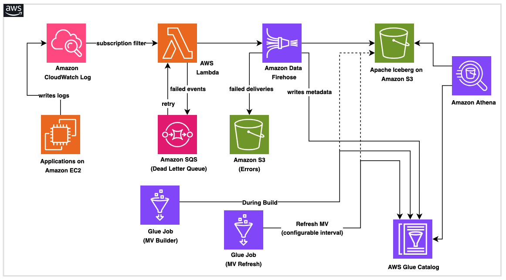

# Sample Log Analytics with Apache Iceberg Materialized Views

An automated deployment of a real-time data pipeline that streams CloudWatch Logs into Apache Iceberg tables with materialized views, using AWS Glue, Amazon Data Firehose, and AWS Lambda. The entire pipeline deploys with a single CloudFormation stack — no manual script uploads or multi-step orchestration needed.

## Architecture



**Components:**
- **AWS Glue Job (MV Builder)** — Creates the Iceberg database, base table with sample data, and a materialized view for pre-aggregated analytics
- **AWS Glue Job (MV Refresh)** — Refreshes the materialized view on a daily schedule via a Glue trigger
- **AWS Lambda** — Processes CloudWatch Logs events, extracts structured fields, and forwards to Firehose
- **Amazon Data Firehose** — Buffers and delivers records to the Iceberg table with Iceberg destination
- **CloudWatch Subscription Filter** — Connects a log group to the Lambda function
- **Iceberg Materialized View** — Pre-computes aggregations (order count and total amount per customer) for fast query performance
- **Dead Letter Queue (SQS)** — Captures failed Lambda invocations for automatic retry, with a permanent failure queue after 3 attempts
- **Custom Resource (Artifact Uploader)** — Automatically uploads Glue scripts and Lambda zip to S3 during stack deployment

## Project Structure

```
├── cloudformation/
│   └── iceberg-pipeline.yaml               # Single-stack CloudFormation template
├── images/
│   └── Arch-Sample.png                     # Architecture diagram
├── scripts/
│   ├── sample-glue-job-iceberg-materializedview-builder.py  # Glue ETL script
│   ├── glue-job-mv-refresh.py             # Glue MV refresh script
│   ├── lambda_function.py                  # Lambda function code
│   └── send_test_logs.py                   # Test script to send sample logs
├── CODE_OF_CONDUCT.md
├── CONTRIBUTING.md
├── LICENSE
├── README.md
└── requirements.txt                        # Python dependencies
```

## Prerequisites

- An [AWS account](https://aws.amazon.com/) with an IAM user or role that has permissions to:
  - **CloudFormation** — create, update, and delete stacks
  - **IAM** — create roles and policies (`iam:CreateRole`, `iam:PutRolePolicy`, `iam:AttachRolePolicy`, `iam:PassRole`)
  - **S3** — create buckets and upload objects
  - **AWS Glue** — create and run jobs, manage databases and tables
  - **Amazon Data Firehose** — create and manage delivery streams
  - **AWS Lambda** — create and manage functions
  - **CloudWatch Logs** — create log groups, subscription filters
  - **Amazon SQS** — create queues
  - **Amazon Athena** — run queries to verify Iceberg table data
  - **Python 3.9+** (for running the test script and test suite)
  - **AWS CLI v2** (if deploying via CLI)

> **Tip:** For a quick start, use an IAM principal with `AdministratorAccess`. For production, scope permissions down to the specific resources created by the stack.

## Deployment

### Launch Stack

### Step 1: Deploy the pipeline stack

Deploy the entire solution with a single CloudFormation stack. The template automatically creates S3 buckets, uploads all scripts, provisions IAM roles, configures Firehose, and runs the Glue job to create the Iceberg table and materialized view.

Resource names are automatically suffixed with a timestamp for uniqueness. To use a custom suffix instead, pass the `ResourceSuffix` parameter.

**Via CLI:**

```bash
aws cloudformation deploy \
  --template-file cloudformation/iceberg-pipeline.yaml \
  --stack-name iceberg-pipeline \
  --parameter-overrides \
    IcebergDataBucketName="your-company-iceberg-data" \
    IcebergErrorsBucketName="your-company-iceberg-errors" \
    GlueScriptBucketName="your-company-glue-scripts" \
  --capabilities CAPABILITY_NAMED_IAM
```

To specify a custom suffix (instead of auto-generated timestamp):

```bash
aws cloudformation deploy \
  --template-file cloudformation/iceberg-pipeline.yaml \
  --stack-name iceberg-pipeline \
  --parameter-overrides \
    IcebergDataBucketName="your-company-iceberg-data" \
    IcebergErrorsBucketName="your-company-iceberg-errors" \
    GlueScriptBucketName="your-company-glue-scripts" \
    ResourceSuffix="prod01" \
  --capabilities CAPABILITY_NAMED_IAM
```

**Via Console:**

1. Go to **CloudFormation console** → **Create stack** → **Upload a template file**
2. Upload `cloudformation/iceberg-pipeline.yaml`
3. Review parameters — they are grouped into **[REQUIRED]** and **Safe defaults**:
   - Provide globally unique S3 bucket base names (a timestamp or custom suffix is appended automatically)
   - Set `CreateScriptBucket` to `false` if reusing an existing S3 bucket
   - Set `EnableLakeFormation` to `true` if your account uses Lake Formation
   - Set `CreateSubscriptionLogGroup` to `false` if the log group already exists
   - Optionally set `ResourceSuffix` to a custom value (e.g., `prod01`). Leave blank for auto-generated timestamp.
4. Check **I acknowledge that AWS CloudFormation might create IAM resources with custom names** → **Submit**

The stack takes approximately 10–15 minutes to complete.

### Step 2: Test the end-to-end pipeline

Send sample log events matching the Iceberg table schema to the CloudWatch Log Group:

```bash
python3 -m venv .venv
source .venv/bin/activate
pip install -r requirements.txt
python3 scripts/send_test_logs.py
```

The subscription filter triggers the Lambda, which forwards records to Firehose for delivery into the Iceberg table.

### Step 3: Verify data delivery

Allow approximately 30 seconds for the Firehose buffer to flush, then query in Amazon Athena:

```sql
-- Verify base table
SELECT * FROM stream_analytics.application_logs ORDER BY order_date DESC LIMIT 10;

-- Verify materialized view
SELECT * FROM stream_analytics.application_logs_mv ORDER BY customer_name;
```

### Automated materialized view refresh

The stack provisions a scheduled Glue trigger that automatically runs the MV refresh job daily at midnight (UTC). As new data streams in through Firehose, the trigger keeps the materialized view current without manual intervention.

## Key Parameters

| Parameter | Required | Description |
|-----------|----------|-------------|
| `IcebergDataBucketName` | Yes | Base name for the Iceberg data bucket (suffix appended automatically) |
| `IcebergErrorsBucketName` | Yes | Base name for the failed records bucket (suffix appended automatically) |
| `GlueScriptBucketName` | Yes | Base name for the scripts bucket (suffix appended automatically) |
| `CreateScriptBucket` | Yes | Set to `false` if the script bucket already exists |
| `EnableLakeFormation` | Yes | Set to `true` if using Lake Formation |
| `CreateSubscriptionLogGroup` | Yes | Set to `false` if the log group already exists |
| `ResourceSuffix` | No | Custom suffix for resource names. Leave blank for auto-timestamp. Use only lowercase letters and numbers. |

> **Naming result:** `{base-name}-{suffix}` — e.g., `your-company-iceberg-data-20250624143022` or `your-company-iceberg-data-prod01`

## Cleanup

**Via Console:**

1. Go to **CloudFormation console** → select your stack → **Delete**
2. Empty and delete the S3 buckets manually from the **S3 console** (CloudFormation cannot delete non-empty buckets)

**Via CLI:**

```bash
# Empty and delete S3 buckets (replace with your actual bucket names including suffix)
aws s3 rm s3://your-company-iceberg-data-SUFFIX --recursive
aws s3 rb s3://your-company-iceberg-data-SUFFIX
aws s3 rm s3://your-company-iceberg-errors-SUFFIX --recursive
aws s3 rb s3://your-company-iceberg-errors-SUFFIX
aws s3 rm s3://your-company-glue-scripts-SUFFIX --recursive
aws s3 rb s3://your-company-glue-scripts-SUFFIX

# Delete the stack
aws cloudformation delete-stack --stack-name iceberg-pipeline
```

## Running Tests

```bash
python -m pytest tests/ -v
```

## License

MIT

## Disclaimer

AWS code samples are example code that demonstrates practical implementations of AWS services for specific use cases and scenarios.

These application solutions are not supported products in their own right, but educational examples to help our customers use our products for their applications. As our customer, any applications you integrate these examples into should be thoroughly tested, secured, and optimized according to your business's security standards & policies before deploying to production or handling production workloads.
